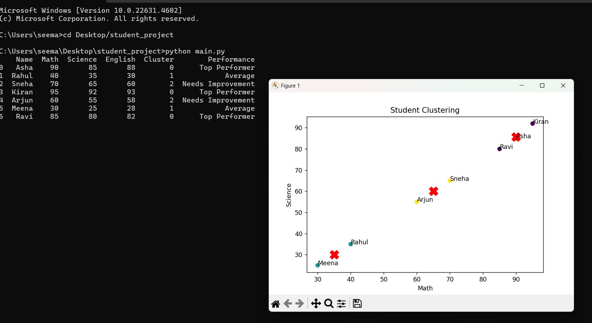

# Student Performance Analyzer

This project uses K-Means Clustering to group students based on their marks.

## Features
- Groups students into performance categories
- Visualizes clusters using graph
- Shows centroids and labels

## Technologies Used
- Python
- Pandas
- Matplotlib
- Scikit-learn

## Output

## Author
Seema Aratal
